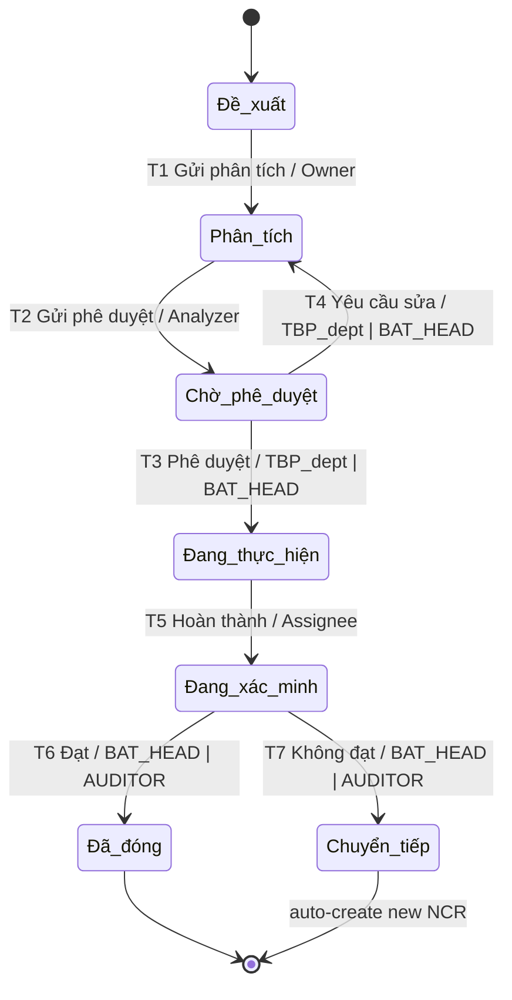
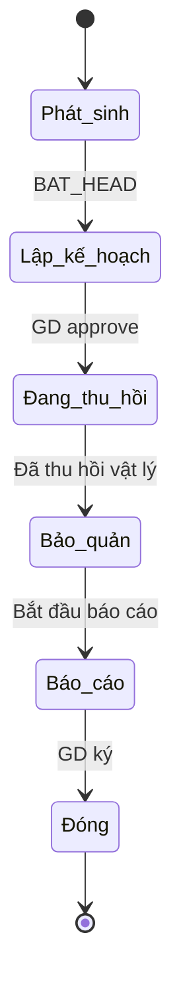
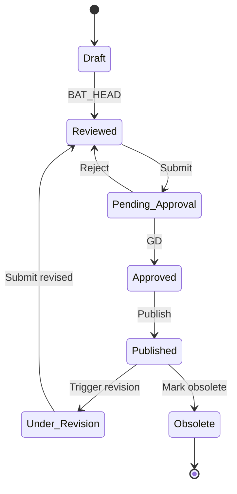
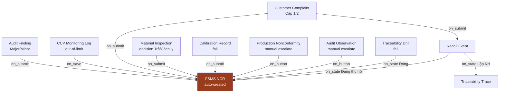

# 04 — Workflow Blueprint

> **App**: `iso22000_fsms` · Frappe v16
> **Trạng thái**: Draft v0.1 — chờ review trước khi sang `05_integration_plan.md`
> **Phụ thuộc**: `01_business_model.md`, `02_doctype_blueprint.md`, `03_permission_matrix.md`

---

## 0. Conventions

### 0.1 Mục tiêu
Chốt **state machine** cho mọi DocType có workflow, chuẩn để `nextcode-build` chuyển thẳng thành Frappe Workflow JSON + Server Script transitions.

### 0.2 Frappe Workflow engine note
- Mỗi DocType có workflow → tạo 1 record `Workflow` (Frappe core DocType)
- `Workflow State` = list state, có thể share giữa workflows (ví dụ `Draft`, `Approved` dùng chung)
- `Workflow Action` = nút bấm trong UI (`Submit for Review`, `Approve`, `Reject`...)
- `Workflow Transition` = (state from + action + state to + role allowed)
- `workflow_state` field tự auto-populated trong DocType

### 0.3 Notation cho state diagram
- `[*] → State A` = entry (từ Draft khi tạo mới)
- `State A → State B : Action / Role / Condition` = transition
- `State X → [*]` = exit (workflow đóng)

### 0.4 Notification chuẩn cho mọi transition
Trừ khi note khác, mọi transition `enter new state` sẽ:
- Gửi email cho `assigned_to` của state mới (nếu DocType có field này)
- Gửi in-app notification cho approver hợp lệ
- Log vào Frappe Activity Log + Comments

### 0.5 GD (Director) policy clarification
Theo decision của anh:
- **Default**: GD KHÔNG can thiệp record-level vào workflow thường ngày.
- **Exception** — GD record-level approve chỉ khi:
  - DocType cấp công ty: `FSMS Manual`, `FSMS Policy`, `FSMS HACCP Plan`, `FSMS Recall Event`, `FSMS Recall Plan`, `FSMS Recall Report`, `FSMS Management Review`
  - NCR escalated với `severity = Critical` (workflow auto-route, xem §1)
  - Risk Register có `total_score >= 12` (Cấp Ứng phó kịp thời)
- **Default operating model**: GD xem **GD Dashboard** (sẽ thiết kế ở `05_integration_plan.md`) gồm: số NCR mở/đóng, audit findings trend, recall events, KPI mục tiêu, calibration overdue, training compliance, risk heatmap.

### 0.6 Workflow inventory

| # | DocType | Số state | Phân loại |
|---|---------|----------|-----------|
| 1 | `FSMS NCR` | 7 | TÂM ĐIỂM — chi tiết §1 |
| 2 | `FSMS Recall Event` | 6 | §2.1 |
| 3 | `FSMS Recall Plan` | 4 | §2.2 |
| 4 | `FSMS Recall Report` | 5 | §2.3 |
| 5 | `FSMS Audit Program` | 4 | §3.1 |
| 6 | `FSMS Audit Plan` | 5 | §3.2 |
| 7 | `FSMS Audit Execution` | 4 | §3.3 |
| 8 | `FSMS Audit Summary` | 3 | §3.4 |
| 9 | `FSMS Document Change Request` | 5 | §4 |
| 10 | `FSMS Manual` | 5 | §5.1 |
| 11 | `FSMS Policy` | 5 | §5.2 (giống Manual) |
| 12 | `FSMS Objective` | 4 | §5.3 |
| 13 | `FSMS HACCP Plan` | 6 | §5.4 |
| 14 | `FSMS Verification Plan` | 4 | §6.1 |
| 15 | `FSMS Verification Report` | 4 | §6.2 |
| 16 | `FSMS Risk Register` | 4 | §7 |
| 17 | `FSMS Calibration Plan` | 4 | §8.1 |
| 18 | `FSMS Calibration Record` | 3 | §8.2 |
| 19 | `FSMS Supplier Evaluation` | 3 | §9 |
| 20 | `FSMS Customer Complaint` | 5 | §10 |
| 21 | `FSMS Management Review` | 5 | §11 |
| 22 | `FSMS Training Plan` | 4 | §12.1 |
| 23 | `FSMS Training Session` | 4 | §12.2 |
| 24 | `FSMS Traceability Drill` | 4 | §13.1 |
| 25 | `FSMS Traceability Trace` | 3 | §13.2 |
| 26 | `FSMS Emergency Event` | 4 | §14 |
| 27 | `FSMS Sanitation Report` | 3 | §15 |
| 28 | `FSMS Material Inspection Log` | 3 | §16 |

→ 28 workflows tổng. NCR là tâm, các cái khác feed/escalate vào NCR.

---

## 1. `FSMS NCR` — TÂM ĐIỂM (7 states)

### 1.1 State list

| # | State | Frappe state | Doc status | Mô tả |
|---|-------|--------------|------------|-------|
| 1 | Đề xuất | `Đề xuất` | 0 (Draft) | Vừa tạo, chưa qua phân tích nguyên nhân |
| 2 | Phân tích | `Phân tích` | 0 (Draft) | Đang phân tích root cause + biện pháp |
| 3 | Chờ phê duyệt | `Chờ phê duyệt` | 0 (Draft) | Chờ TBP của Department bị ảnh hưởng (hoặc BAT_HEAD override) phê duyệt phương án |
| 4 | Đang thực hiện | `Đang thực hiện` | 1 (Submitted) | Đã phê duyệt, đang triển khai action items |
| 5 | Đang xác minh | `Đang xác minh` | 1 (Submitted) | Action items hoàn thành, chờ verifier check kết quả |
| 6 | Đã đóng | `Đã đóng` | 1 (Submitted) | Verify đạt yêu cầu, đóng phiếu |
| 7 | Chuyển tiếp | `Chuyển tiếp` | 1 (Submitted) | Verify không đạt → tự sinh phiếu mới link `reissued_to_ncr` |

### 1.2 Transition table

| # | From | Action | To | Role allowed | Server validation |
|---|------|--------|-----|--------------|--------------------|
| T1 | Đề xuất | "Gửi phân tích" | Phân tích | Owner / BAT_HEAD / BAT_MEMBER | `nonconformity_description` not empty + có ít nhất 1 attachment hoặc evidence text |
| T2 | Phân tích | "Gửi phê duyệt" | Chờ phê duyệt | Analyzer / BAT_HEAD | `root_cause_analysis` + `proposed_action` + `assigned_to` + `proposed_completion_date` not empty |
| T3 | Chờ phê duyệt | "Phê duyệt" | Đang thực hiện | TBP của `affected_department` HOẶC BAT_HEAD HOẶC (GD nếu severity=Critical) | Set `approved_by` + `approved_on` + `approved_signature` (auto from Employee) |
| T4 | Chờ phê duyệt | "Yêu cầu sửa" | Phân tích | Same as T3 | `approver_remarks` not empty (lý do trả về) |
| T5 | Đang thực hiện | "Hoàn thành thực hiện" | Đang xác minh | Assignee / BAT_HEAD | Tất cả `action_items.status = 'Hoàn thành' hoặc 'Hủy'` + `actual_completion_date` not empty |
| T6 | Đang xác minh | "Đạt — đóng phiếu" | Đã đóng | BAT_HEAD / AUDITOR | Set `verifier_*` + `verification_outcome = 'Đạt yêu cầu'` + `closed_date` |
| T7 | Đang xác minh | "Không đạt — chuyển tiếp" | Chuyển tiếp | BAT_HEAD / AUDITOR | Set `verification_outcome = 'Không đạt'`. Server hook auto-create new NCR linked via `reissued_to_ncr` ↔ `reissued_from_ncr` |
| T8 | (Đã đóng, sau N ngày) | "Verify hiệu lực" | (giữ nguyên — chỉ update L3 fields) | BAT_HEAD / AUDITOR | Set `effectiveness_check_date` + `effectiveness_check_result`. Nếu `Không hiệu lực` → server hook tạo NCR mới |

### 1.3 State diagram (mermaid)



### 1.4 Field locking per state (Frappe Workflow `allow_edit`)

| State | Roles có write | Fields locked (read-only cho roles không trong allow_edit) |
|-------|----------------|------------------------------------------------------------|
| Đề xuất | Owner, BAT_HEAD, BAT_MEMBER | — |
| Phân tích | Analyzer, BAT_HEAD | Phần 1 fields lock (description, evidence, requestor) |
| Chờ phê duyệt | TBP_dept, BAT_HEAD, GD nếu Critical | Phần 1+2 lock; chỉ approver edit phần 3 |
| Đang thực hiện | Assignee, Action Item owners, BAT_HEAD | Phần 1+2+3 lock; chỉ phần action items + actual_completion_date edit được |
| Đang xác minh | Verifier (BAT_HEAD/AUDITOR) | Tất cả phần 1+2+3+actions lock; chỉ phần 4 edit |
| Đã đóng | (không ai edit fields chính, chỉ effectiveness check L3) | TẤT CẢ permlevel 0 lock; chỉ L3 fields cho BAT_HEAD/AUDITOR |
| Chuyển tiếp | Không ai edit | Phiếu này đã đóng, link sang phiếu mới |

### 1.5 Server hooks chi tiết

```python
# iso22000_fsms/fsms_ncr/doctype/fsms_ncr/fsms_ncr.py

def on_update_after_submit(self):
    # When verification fails -> auto-create new NCR
    if self.workflow_state == "Chuyển tiếp" and not self.reissued_to_ncr:
        new = frappe.copy_doc(self)
        new.workflow_state = "Đề xuất"
        new.docstatus = 0
        new.reissued_from_ncr = self.name
        new.nonconformity_description = (
            f"Tiếp nối phiếu {self.name} (verify không đạt). " 
            f"Lý do: {self.verification_remarks}"
        )
        new.insert(ignore_permissions=True)
        self.db_set("reissued_to_ncr", new.name)
        frappe.publish_realtime(
            event="ncr_reissued",
            message={"old": self.name, "new": new.name},
            user=self.requestor
        )

def validate_critical_severity_escalation(self):
    # If severity = Critical, route approval to GD
    if (self.severity == "Critical" 
        and self.workflow_state == "Chờ phê duyệt"
        and not has_role(frappe.session.user, "FSMS Director")):
        if not has_role(frappe.session.user, "FSMS Manager"):
            frappe.throw("NCR Critical severity yêu cầu phê duyệt từ GD hoặc BAT_HEAD")

# Scheduled job nightly
def check_overdue_ncr():
    overdue = frappe.get_all(
        "FSMS NCR",
        filters={
            "workflow_state": "Đang thực hiện",
            "proposed_completion_date": ["<", today()]
        },
        fields=["name", "assigned_to", "approver", "proposed_completion_date"]
    )
    for ncr in overdue:
        days_late = (today() - ncr.proposed_completion_date).days
        # send escalation email; if > 7 days late, escalate to BAT_HEAD
```

### 1.6 Auto-create chain (sources → NCR)

| Source DocType | Trigger | Auto-fill on NCR |
|----------------|---------|-------------------|
| `FSMS Audit Finding` (Major/Minor) | `auto_create_ncr = True` on parent Audit Execution | `ncr_source = "Audit"`, `nonconformity_description = finding_description`, `affected_department = auditee_department` |
| `FSMS CCP Monitoring Log` | `is_within_limit = False` | `ncr_source = "CCP Fail"`, severity = Major/Critical (theo CCP definition), `affected_department = Sản xuất` |
| `FSMS Customer Complaint` (severity Cấp 1/2) | `auto_create_ncr = True` | `ncr_source = "Customer Complaint"`, `affected_department = Sản xuất` (mặc định) |
| `FSMS Material Inspection Log` (decision = Trả/Cách ly) | trên submit | `ncr_source = "Supplier Reject"`, `affected_department = Kế hoạch–Tổng hợp` (mua hàng) |
| `FSMS Calibration Record` (`cal_result = Không đạt`) | trên submit | `ncr_source = "Equipment Fail"`, `affected_department = Sản xuất` |
| `FSMS Production Nonconformity` (escalation) | manual button "Escalate to NCR" | `ncr_source = "Internal Report"` |
| `FSMS Audit Observation` (manual escalation) | manual button | tương tự |

→ Tất cả sử dụng `frappe.flags.ignore_permissions = True` trong server hook và set đúng `owner` để ifowner / User Permission của requestor hoạt động đúng.

---

## 2. Recall family (QT 02)

### 2.1 `FSMS Recall Event` — 6 states

| # | State | Mô tả |
|---|-------|-------|
| 1 | Phát sinh | Vừa tạo, đang thu thập thông tin lô |
| 2 | Lập kế hoạch | Đang xây Recall Plan |
| 3 | Đang thu hồi | GD đã ban hành "thông báo thu hồi", các bộ phận đang thực thi |
| 4 | Bảo quản | Đã thu về, hàng lưu khu vực "Hàng thu hồi" có khóa |
| 5 | Báo cáo | Đang viết Recall Report |
| 6 | Đóng | GD ký duyệt Report, gửi cơ quan QLNN nếu cần |

| # | From | Action | To | Role | Validation |
|---|------|--------|-----|------|------------|
| T1 | Phát sinh | "Bắt đầu lập kế hoạch" | Lập kế hoạch | BAT_HEAD | `affected_batches` >= 1, `defect_severity` set, `recall_level` set |
| T2 | Lập kế hoạch | "GD phê duyệt thu hồi" | Đang thu hồi | GD | Phải có `recall_plan` link và Plan đã ở state "Approved" |
| T3 | Đang thu hồi | "Đã thu hồi vật lý" | Bảo quản | BAT_HEAD / TBP_KD | Tổng `recovered_qty` từ Affected Batches >= ngưỡng theo recall_level |
| T4 | Bảo quản | "Bắt đầu báo cáo" | Báo cáo | BAT_HEAD | Có `disposal_method` xác định |
| T5 | Báo cáo | "GD ký duyệt báo cáo" | Đóng | GD | `recall_report` link tồn tại và Report ở state "Approved by GĐ" |



**Server hooks**:
- On enter `Đang thu hồi`: auto-create `FSMS NCR` (severity=Critical nếu defect_level=Cấp 1, Major nếu Cấp 2, Minor nếu Cấp 3)
- On enter `Lập kế hoạch`: auto-create `FSMS Traceability Trace` linked
- On enter `Đóng`: send notification to Management Review (ghi nhận trong cuộc họp gần nhất)

### 2.2 `FSMS Recall Plan` — 4 states

| State | Action → next | Role | Validation |
|-------|---------------|------|------------|
| Draft | "Submit for GD" | BAT_HEAD | `plan_items` >= 1, `target_completion_date`, `quarantine_location` không trống |
| Pending GD | "Approve" → Approved | GD | — |
| Pending GD | "Reject" → Draft | GD | `approver_remarks` |
| Approved | "Start executing" → Executing | BAT_HEAD | (auto khi Recall Event vào "Đang thu hồi") |
| Executing | "Complete" → Completed | BAT_HEAD | All `plan_items.status = Hoàn thành` |

### 2.3 `FSMS Recall Report` — 5 states

| State | Action → next | Role |
|-------|---------------|------|
| Draft | "Reviewed" | BAT_HEAD |
| Reviewed | "Submit to GD" | BAT_HEAD |
| Pending GD | "Approve" → Approved by GĐ | GD |
| Approved by GĐ | "Submit to authority" → Submitted | BAT_HEAD (chỉ khi `external_notification_required = True`) |
| Approved by GĐ | "Close" → Closed | BAT_HEAD |
| Submitted | "Close after authority response" → Closed | BAT_HEAD |

---

## 3. Audit family (QT 01 phần đánh giá)

### 3.1 `FSMS Audit Program` — 4 states

| State | Action → next | Role |
|-------|---------------|------|
| Draft | "Submit for approval" → Pending Approval | BAT_HEAD |
| Pending Approval | "Approve" → Approved | GD |
| Approved | "Start year" → Executing | BAT_HEAD (auto khi Audit Plan đầu tiên start) |
| Executing | "Close year" → Closed | BAT_HEAD (cuối năm sau khi Audit Summary publish) |

### 3.2 `FSMS Audit Plan` — 5 states

| State | Action → next | Role | Validation |
|-------|---------------|------|------------|
| Draft | "Notify auditees" → Notified | BAT_HEAD | `audit_team` >= 1, `audit_date_from/to` set, `criteria_documents` >= 1 |
| Notified | "Start audit" → Executing | BAT_HEAD / AUDITOR | (auto khi Audit Execution đầu tiên submit) |
| Executing | "All sessions done" → Reported | AUDITOR / BAT_HEAD | All `Audit Execution` linked submitted |
| Reported | "Close" → Closed | BAT_HEAD | All Findings → linked NCR closed hoặc OFI accepted |

### 3.3 `FSMS Audit Execution` — 4 states

| State | Action → next | Role | Validation |
|-------|---------------|------|------------|
| Đang thực hiện | "Hoàn thành phỏng vấn" → Hoàn thành | AUDITOR (owner) | `responses` table all filled |
| Hoàn thành | "Trình BAT_HEAD" → Submitted | AUDITOR | All `findings` đã categorize |
| Submitted | "BAT_HEAD review + escalate findings" → Đã đóng | BAT_HEAD | (Findings Major/Minor auto-create NCR per `auto_create_ncr` flag) |

### 3.4 `FSMS Audit Summary` — 3 states

`Draft → Reviewed → Published` (BAT_HEAD draft, BAT_HEAD review, GD publish — for annual summary)

---

## 4. `FSMS Document Change Request` — 5 states

| State | Action → next | Role | Validation |
|-------|---------------|------|------------|
| Đề xuất | "Submit" → Soát xét | Owner | `target_document` set + `proposed_changes` not empty |
| Soát xét | "Reviewed → Phê duyệt" | TBP_KH (cho doc nội bộ thường) hoặc BAT_HEAD | `impact_assessment` not empty |
| Soát xét | "Reject" → Đề xuất | TBP_KH / BAT_HEAD | reject reason |
| Phê duyệt | "Approve → Phát hành" | BAT_HEAD (với QT/BM) hoặc GD (với Sổ tay/Chính sách) | — |
| Phê duyệt | "Reject" → Đề xuất | BAT_HEAD / GD | — |
| Phát hành | "Confirm published" → Đóng | TBP_KH | Đã update `Document Register Internal/External` (server hook auto-update revision) |
| Đóng | — | — | terminal |

**Server hook `on_enter_published`**:
```python
def update_register(self):
    target = frappe.get_doc(self.target_document_doctype, self.target_document_name)
    target.current_revision = self.proposed_revision
    target.effective_date = today()
    # Append to change_history
    target.append("change_history", {
        "change_request": self.name,
        "change_date": today(),
        "summary": self.proposed_changes[:200]
    })
    target.save()
```

---

## 5. Master document workflows

### 5.1 `FSMS Manual` — 5 states

`Draft → Reviewed → Approved → Published → Obsolete`

| State | Action → next | Role |
|-------|---------------|------|
| Draft | "Reviewed" | BAT_HEAD |
| Reviewed | "Submit GD" → Pending Approval | BAT_HEAD |
| Pending Approval | "Approve" → Approved | GD |
| Approved | "Publish" → Published | BAT_HEAD (auto update `effective_date = today`) |
| Published | "Mark obsolete" → Obsolete | BAT_HEAD (when new revision Published replaces it) |

> Manual chỉ có 1 record Single — khi tạo revision mới, clone Single → Doctype History (lưu các bản cũ).
> Workaround: convert Manual sang Doctype với `revision_no` unique key, hoặc tạo `FSMS Manual Revision` Doctype riêng để lưu lịch sử.
> **Decision**: dùng `FSMS Manual` Single + table `revision_history` (đã có trong blueprint). Mỗi lần publish, snapshot field cũ vào row mới của child table.

### 5.2 `FSMS Policy` — 5 states (giống Manual)

### 5.3 `FSMS Objective` — 4 states

| State | Action → next | Role |
|-------|---------------|------|
| Draft | "Submit" → Pending Review | TBP_dept hoặc BAT_HEAD |
| Pending Review | "Review pass" → Approved | BAT_HEAD |
| Pending Review | "Reject" → Draft | BAT_HEAD |
| Approved | "Year ended → mark closed" → Closed | BAT_HEAD (vào dịp Management Review tổng kết năm) |

### 5.4 `FSMS HACCP Plan` — 6 states

`Draft → Reviewed → Approved → Published → Under Revision → Obsolete`

| State | Action → next | Role | Validation |
|-------|---------------|------|------------|
| Draft | "BAT review" → Reviewed | BAT_HEAD | `process_steps` >= 3, `hazards` >= 1, ít nhất 1 CCP |
| Reviewed | "Submit GD" → Pending Approval | BAT_HEAD | — |
| Pending Approval | "Approve" → Approved | GD | — |
| Approved | "Publish + activate" → Published | BAT_HEAD | (auto update Item.haccp_plan link) |
| Published | "Initiate revision" → Under Revision | BAT_HEAD | Trigger: phát hiện hazard mới / change process / annual review / scheduled review |
| Under Revision | "Submit revised" → Reviewed | BAT_HEAD | (loop về Reviewed → Approved → Published, increment `plan_version`) |
| Published | "Mark obsolete" → Obsolete | BAT_HEAD | Khi item ngừng SX hoặc plan cũ replaced |



---

## 6. Verification (QT 04)

### 6.1 `FSMS Verification Plan` — 4 states

`Draft → Approved → Executing → Closed` (BAT_HEAD draft, GD approve, BAT_HEAD execute, BAT_HEAD close)

### 6.2 `FSMS Verification Report` — 4 states

`Draft → Reviewed → Approved → Closed`
- Draft: AUDITOR / QC fill `tests_performed`
- Reviewed: BAT_HEAD review
- Approved: BAT_HEAD approve (không cần GD vì tần suất cao)
- Closed: tự động khi tất cả linked NCR đóng

---

## 7. `FSMS Risk Register` — 4 states

| State | Action → next | Role | Validation |
|-------|---------------|------|------------|
| Draft | "Submit" → Pending Review | TBP_dept hoặc BAT_HEAD | total_score đã compute |
| Pending Review | "Review pass" → Approved | BAT_HEAD (nếu total_score < 12) hoặc GD (nếu total_score >= 12) | — |
| Pending Review | "Reject" → Draft | Same as approver | — |
| Approved | "Re-review" → Pending Review | BAT_HEAD | Trigger: scheduled (next_review_date) hoặc context change |

→ Quy tắc total_score >= 12 yêu cầu GD theo decision của anh (Cấp Ứng phó kịp thời).

---

## 8. Equipment (QT 06)

### 8.1 `FSMS Calibration Plan` — 4 states

`Draft → Approved → Executing → Closed`

### 8.2 `FSMS Calibration Record` — 3 states

| State | Action → next | Role |
|-------|---------------|------|
| Draft | "Submit result" → Submitted | QC |
| Submitted | "BAT_HEAD review" → Verified | BAT_HEAD |
| Submitted | "Result fail → escalate" | (auto-create NCR via server hook) |

---

## 9. `FSMS Supplier Evaluation` — 3 states

`Draft → Reviewed → Approved` (TBP_KH draft, BAT_HEAD review, BAT_HEAD approve)

`on_submit` updates `Supplier Profile.last_evaluation_*` and re-computes `Approved Supplier List` membership.

---

## 10. `FSMS Customer Complaint` — 5 states

| State | Action → next | Role | Validation |
|-------|---------------|------|------------|
| Mới | "Phân loại" → Đang xử lý | TBP_KD | `severity` set, `affected_item` + `affected_batch` set |
| Đang xử lý | "Tạo Recall Event" | TBP_KD / BAT_HEAD | Nếu severity Cấp 1/2 → auto-create `FSMS Recall Event` |
| Đang xử lý | "Tạo NCR" | TBP_KD / BAT_HEAD | Auto-create NCR với `ncr_source = "Customer Complaint"` |
| Đang xử lý | "Đã giải quyết" → Đã giải quyết | TBP_KD | `resolution_text` not empty + `resolution_date` set |
| Đã giải quyết | "Đóng" → Đóng | TBP_KD / BAT_HEAD | `customer_satisfied` checked |
| Đã giải quyết | "Re-open" → Đang xử lý | TBP_KD | Khi KH không hài lòng |

---

## 11. `FSMS Management Review` — 5 states

| State | Action → next | Role |
|-------|---------------|------|
| Đã lên lịch | "Bắt đầu họp" → Đang họp | BAT_HEAD |
| Đang họp | "Kết thúc họp" → Đã họp | BAT_HEAD (chair = GD) |
| Đã họp | "Soạn biên bản" → Đã ban hành | BAT_HEAD (BAT_HEAD draft, GD ký) |
| Đã ban hành | "Theo dõi action" → Đóng | BAT_HEAD (tất cả linked outputs/NCR đã đóng) |

---

## 12. Training (clause 7.2)

### 12.1 `FSMS Training Plan` — 4 states

`Draft → Reviewed → Approved → Executing → Closed` (5 thực ra)

| State | Action → next | Role |
|-------|---------------|------|
| Draft | "Submit" → Reviewed | TBP_KH |
| Reviewed | "Approve" → Approved | BAT_HEAD |
| Approved | "Year start" → Executing | TBP_KH |
| Executing | "Year end" → Closed | TBP_KH |

### 12.2 `FSMS Training Session` — 4 states

`Lên lịch → Đã thực hiện → Đã đánh giá → Đóng`

---

## 13. Traceability (QT 09)

### 13.1 `FSMS Traceability Drill` — 4 states

| State | Action → next | Role | Validation |
|-------|---------------|------|------------|
| Đã lên lịch | "Bắt đầu" → Đang thực hiện | BAT_HEAD | `selected_batch` set, `start_time` auto |
| Đang thực hiện | "Hoàn thành" → Đã hoàn thành | BAT_HEAD | `forward_links` >= 1, `backward_links` >= 1, `actual_completion_time` auto |
| Đã hoàn thành | "Đóng" → Đóng | BAT_HEAD | Nếu `drill_outcome = Không đạt` → auto-create NCR |

### 13.2 `FSMS Traceability Trace` — 3 states

`Đang truy xuất → Đã hoàn thành → Đóng`

---

## 14. `FSMS Emergency Event` — 4 states

| State | Action → next | Role |
|-------|---------------|------|
| Đang xảy ra | "Đã xử lý" → Đã xử lý | BAT_HEAD / TBP_SX |
| Đã xử lý | "Báo cáo" → Đã báo cáo | BAT_HEAD |
| Đã báo cáo | "Đóng" → Đóng | BAT_HEAD |

---

## 15. `FSMS Sanitation Report` — 3 states

`Draft → Reviewed → Approved` (QC draft, BAT_HEAD review + approve)

---

## 16. `FSMS Material Inspection Log` — 3 states

| State | Action → next | Role | Validation |
|-------|---------------|------|------------|
| Draft | "Submit kết quả" → Submitted | NV (kho) | `items` table all filled |
| Submitted | "QC verify" → Verified | QC | (server hook: nếu có dòng `decision = Trả/Cách ly` → auto-create NCR) |

---

## 17. Cross-cutting rules

### 17.1 Approval escalation matrix

| Document | Default approver | Escalate up to GD when |
|----------|------------------|------------------------|
| NCR | TBP_dept hoặc BAT_HEAD | `severity = Critical` |
| Risk Register | BAT_HEAD | `total_score >= 12` |
| HACCP Plan | GD (always) | always |
| Manual / Policy | GD (always) | always |
| Recall Event/Plan/Report | GD (always) | always |
| Management Review | GD (chair) | always |
| Audit Program (yearly) | GD | always |
| Audit Plan, Audit Execution, Audit Summary | BAT_HEAD | never (except Critical findings escalate trong NCR) |
| Supplier Evaluation | BAT_HEAD | never |
| Verification Plan/Report | BAT_HEAD (Plan có thể GD nếu strategic) | never |
| Calibration | BAT_HEAD | never |
| Customer Complaint | BAT_HEAD | severity Cấp 1 (auto-tạo Recall → escalate qua Recall) |
| Training Plan | BAT_HEAD | never |
| Traceability Drill | BAT_HEAD | never |
| Emergency Event | BAT_HEAD | when external authority involved |

### 17.2 OR-logic approval (TBP_dept ∨ BAT_HEAD) implementation

Frappe Workflow native không có OR. Cách triển khai:

1. **Tạo custom role per Department**: `Production Department Head`, `Sales Department Head`, `Planning Department Head`, `Accounting Department Head`. Gán cho TBP_xx tương ứng.
2. **Workflow Transition** trên state `Chờ phê duyệt` của NCR cho phép action `Phê duyệt` từ:
   - Role `FSMS Manager` (BAT_HEAD)
   - HOẶC Role `Production Department Head`
   - HOẶC Role `Sales Department Head`
   - HOẶC Role `Planning Department Head`
   - HOẶC Role `Accounting Department Head`
3. **Server validation** trên transition: nếu user là Department Head, check `affected_department` matches:

```python
def before_workflow_transition(doc, action, new_state, old_state):
    if doc.doctype == "FSMS NCR" and new_state == "Đang thực hiện":
        user = frappe.session.user
        if has_role(user, "FSMS Manager"):
            return  # BAT_HEAD pass
        # Check department head match
        user_dept = get_user_department_head_role(user)  # returns dept name or None
        if user_dept and user_dept == doc.affected_department:
            return
        # Critical → only GD or BAT_HEAD
        if doc.severity == "Critical" and not has_role(user, "FSMS Director"):
            frappe.throw("NCR Critical chỉ GD hoặc BAT_HEAD phê duyệt")
        frappe.throw("Bạn không có quyền phê duyệt NCR này")
```

→ Tạo `fsms_workflow_validation.py` chứa hàm `before_workflow_transition`, hook vào Frappe via `doc_events`.

### 17.3 Auto-create chain summary diagram



### 17.4 Notification matrix

| Event | Recipient | Channel |
|-------|-----------|---------|
| NCR enter `Phân tích` | `assigned_to` (analyzer) | Email + In-app |
| NCR enter `Chờ phê duyệt` | TBP của `affected_department` + BAT_HEAD | Email + In-app |
| NCR enter `Đang thực hiện` | `assigned_to` | Email + In-app |
| NCR enter `Đang xác minh` | `verifier` (BAT_HEAD/AUDITOR) | Email + In-app |
| NCR enter `Đã đóng` | `requestor` + `affected_department.head` | Email |
| NCR enter `Chuyển tiếp` | `requestor` + BAT_HEAD | Email + In-app + reference link to new NCR |
| NCR overdue (`proposed_completion_date < today`) | `assigned_to` + `approver` | Email daily digest |
| NCR overdue 7 days | + BAT_HEAD escalation | Email |
| Recall Event created | GD + BAT_HEAD + TBP_KD + TBP_SX | Email immediate + SMS (nếu tích hợp) |
| Calibration overdue 14 days | QC + TBP_SX + BAT_HEAD | Email weekly |
| Document review due in 30 days | document `owner_employee` + BAT_HEAD | Email monthly digest |
| Audit Plan kickoff trong 7 ngày | `audit_team` + auditees | Email |
| HACCP Plan annual review due | BAT_HEAD | Email 60 ngày trước |
| Training compliance < 80% (employee chưa hoàn thành required course) | `employee.reports_to` + BAT_HEAD | Email monthly |

### 17.5 Submit/Cancel/Amend × Workflow alignment

Quan trọng: `docstatus` (0/1/2) phải khớp với `workflow_state`:

| Workflow state | docstatus expected |
|----------------|---------------------|
| Draft / Đề xuất / Phân tích / Chờ phê duyệt / Mới / Đang xảy ra / Submitted (audit) | 0 (Draft) |
| Approved / Đang thực hiện / Đang xác minh / Đã hoàn thành / Đã ban hành / Verified | 1 (Submitted) |
| Đã đóng / Đóng / Closed / Obsolete | 1 (Submitted) |
| Cancelled (manual cancel) | 2 (Cancelled) |

→ Khi configure `Workflow.is_active`, set `doc_status` đúng cho mỗi `Workflow State`.

### 17.6 Workflow shared states — fixtures

Các state có thể share giữa workflows (giảm số lượng `Workflow State` records):

| Shared state name | Used by |
|-------------------|---------|
| `Draft` | Manual, Policy, HACCP Plan, Audit Program, Audit Plan, Verification Plan, Calibration Plan, Training Plan, Sanitation Report, Material Inspection Log, ... |
| `Reviewed` | Manual, Policy, HACCP Plan, Sanitation Report, Supplier Evaluation, Verification Report, ... |
| `Approved` | Manual, Policy, HACCP Plan, Audit Program, Recall Plan, Verification Plan, ... |
| `Published` | Manual, Policy, HACCP Plan |
| `Đóng` / `Closed` | NCR, Recall, Audit, Manual (Obsolete), Document Change Request, Verification Report, Customer Complaint, ... |

→ Ship qua `fixtures/workflow_state.json`, mỗi state chỉ tạo 1 lần, reuse khắp nơi.

---

## 18. Trạng thái + bước tiếp theo

- **Đã hoàn thành**: 00 inventory + 01 business model + 02 doctype blueprint + 03 permission matrix + **04 workflow blueprint** + QT 09 full text
- **Đang chờ**: anh review file này, đặc biệt:
  - NCR transitions §1.2 và OR-logic approval §17.2 — confirm cách triển khai?
  - Auto-create chain §17.3 — có muốn thêm/bớt nguồn nào không?
  - Notification §17.4 — anh có muốn thêm Telegram / Zalo OA channel cho high-severity (NCR Critical, Recall) như anh đã có infrastructure trong RVHG không?
  - Recall Event escalation phải qua GD — có cần fast-track cho Cấp 1 (nguy hiểm tử vong) không (vd auto-approve nếu thông báo qua điện thoại trước)?
- **Sau khi duyệt 04**: Em sang `05_integration_plan.md` — chi tiết hooks.py + ERPNext core integration + scheduled jobs + GD Dashboard design + Telegram/Zalo notification (nếu anh confirm).

---

**End of `04_workflow_blueprint.md` — chờ anh review.**
